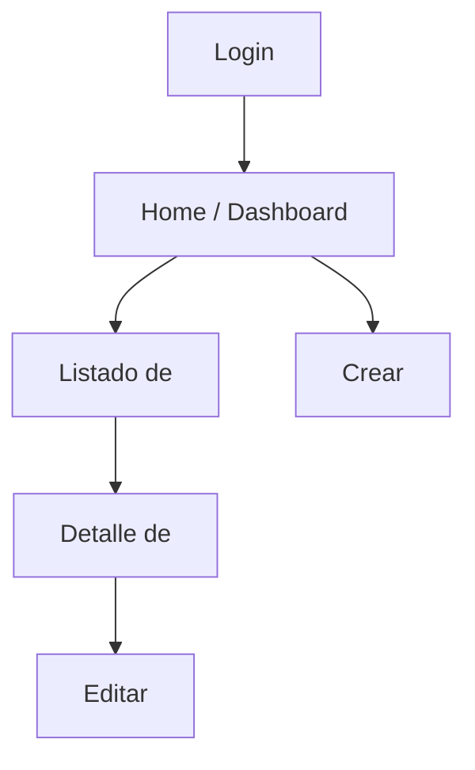

# /flujo — Fase intermedia: Flujo de App

A partir de `plan.md` (rutas/vistas principales), el coordinador mapea
cómo navega el usuario entre pantallas, antes de que `frontend` empiece
a construir nada. Se guarda en `flujo-app.md`.

## Por qué existe

Sin esto, cada vista de `frontend` se construye "suelta" y el enlazado
entre pantallas se improvisa sobre la marcha. Con el flujo mapeado antes,
`frontend` sabe qué botón lleva a dónde y qué datos necesita pasar entre
pantallas (ej. el ID del pedido al pasar de "listado" a "detalle").

## Qué captura `flujo-app.md`

Un diagrama Mermaid de flujo, más una tabla de transiciones:

~~~markdown
# Flujo de App: <nombre del proyecto>



## Transiciones clave

| Desde | Acción del usuario | Hacia | Datos que viajan |
|---|---|---|---|
| Listado | Click en fila | Detalle | ID de la entidad |
| Detalle | Botón "Editar" | Editar | ID + datos actuales |
| Crear | Guardar | Listado (o Detalle) | — |

## Estados especiales
<pantallas de error, vacío, sin permisos — si aplica>

## Onboarding (si el proyecto tiene registro de usuarios)
<qué ve un usuario la primera vez: tour guiado, estado vacío con
llamada a la acción, checklist de primeros pasos — la falta de
onboarding es la causa más común de abandono en el primer uso, no lo
dejes para "ya se verá">

## Wireframe de las pantallas principales (arquitectura de información)
<para cada pantalla clave, un wireframe simple en ASCII o descripción
de bloques — disposición antes de vestirla con diseño real (eso es
design-brief.md)>

```
+--------------------------------+
| Header / nav                    |
+--------------------------------+
| Filtros / búsqueda              |
+--------------------------------+
| Tabla / listado de <entidad>    |
+--------------------------------+
| Paginación                      |
+--------------------------------+
```
~~~

## Modo POC
Solo el diagrama de flujo principal (login → acción central → fin), sin
tabla de transiciones detallada. Suficiente para que `frontend` no
construya pantallas huérfanas.

## Modo Producción
Incluye estados especiales (vacío, error, sin permisos) y roles distintos
si `spec.md` define más de un tipo de usuario con flujos diferentes.

## Salida
`flujo-app.md` en la raíz, antes de delegar a `frontend`.
