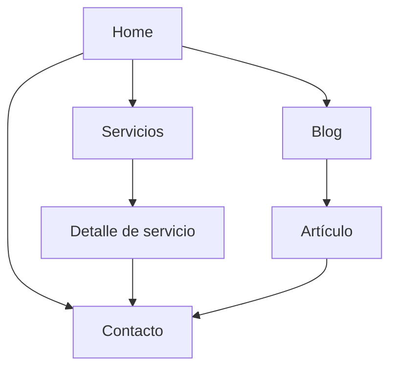

# /flujo — Fase intermedia: Flujo de App/Web

A partir de `plan.md` (arquitectura de páginas), el coordinador mapea
cómo navega el usuario entre páginas antes de que `frontend` construya
nada. Se guarda en `flujo-app.md`.

## Por qué existe

Sin esto, el enlazado interno (importante para SEO) se improvisa página
a página. Con el flujo mapeado antes, `content-seo` puede planificar
enlaces internos coherentes con el recorrido real del usuario, no ad-hoc.

## Qué captura `flujo-app.md`

~~~markdown
# Flujo de navegación: <nombre del proyecto>



## Rutas de conversión
<qué recorrido lleva al objetivo de negocio de spec.md: ej. Home →
Servicios → Contacto>

## Páginas huérfanas a evitar
<páginas que no deberían quedar sin enlaces internos entrantes>

## Wireframe de las páginas principales (arquitectura de información)
<para cada página clave, un wireframe simple en ASCII o descripción de
bloques — no es diseño visual todavía (eso es design-brief.md), es la
disposición de secciones antes de vestirlas>

```
+--------------------------------+
| Header / nav                    |
+--------------------------------+
| Hero: titular + CTA             |
+--------------------------------+
| Sección: <qué va aquí>          |
+--------------------------------+
| Footer: legal, contacto         |
+--------------------------------+
```
~~~

## Modo POC
Solo el diagrama con las páginas principales, sin ruta de conversión
detallada.

## Modo Producción
Incluye explícitamente las rutas de conversión y qué páginas son
"hub" de enlazado interno (las que más enlaces internos deberían recibir
por su relevancia SEO).

## Salida
`flujo-app.md` en la raíz, antes de delegar a `frontend`/`content-seo`.
